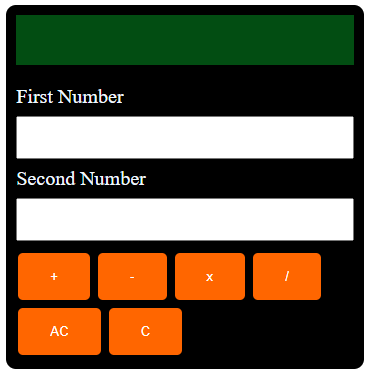

# PHP Calculator

This project is a simple web-based calculator built using PHP and HTML. It allows users to perform basic arithmetic operations like addition, subtraction, multiplication, and division. This README file will guide you through the structure and usage of the code.



## Table of Contents

1. [Installation](#installation)
2. [Usage](#usage)
3. [File Structure](#file-structure)
4. [Code Overview](#code-overview)

## Installation

1. **Clone the Repository:**
   ```bash
   git clone https://github.com/SathiraSriSathsara/php-calculator-app.git
   cd php-calculator-app
   ```

2. **Ensure you have a local server setup:**
   - Install XAMPP, WAMP, or any other local server solution.
   - Move the cloned repository to the server's root directory (e.g., `htdocs` for XAMPP).

3. **Start the local server:**
   - Open the control panel for your server solution and start the Apache server.

4. **Access the Calculator:**
   - Open your web browser and navigate to `http://localhost/php-calculator-app` (assuming the folder is named `php-calculator-app`).

## Usage

1. **Open the Calculator in a Web Browser:**
   - Navigate to the URL where the calculator is hosted on your local server.

2. **Perform Calculations:**
   - Enter the first number in the "First Number" input field.
   - Enter the second number in the "Second Number" input field.
   - Click on one of the operation buttons (`+`, `-`, `x`, `/`) to perform the respective operation.
   - The result will be displayed on the screen.
   - Click on `AC` to clear the result.
   - Click on `C` to reset the input fields.

## File Structure

The project directory contains the following files and folders:

```
php-calculator/
│
├── app/
│   └── logic.php
│
├── style/
│   └── style.css
│
└── index.html
```

- **app/logic.php:** Contains the PHP logic for performing arithmetic operations.
- **style/style.css:** Contains the CSS for styling the calculator.
- **index.html:** The main HTML file that renders the calculator interface.

## Code Overview

### index.html

The `index.html` file contains the structure of the calculator interface. It includes the following key sections:

- **Head Section:**
  ```html
  <head>
      <meta charset="UTF-8">
      <meta name="viewport" content="width=device-width, initial-scale=1.0">
      <link rel="stylesheet" href="./style/style.css">
      <title>Calculator by Sathira Sri Sathsara</title>
  </head>
  ```

- **Form Section:**
  ```html
  <form method="post">
      <div class="center cal">
          <div class="rectangle">
              <?php 
              include './app/logic.php';
              echo '<label class="output">'.$result.'</label>';
              if(isset($_POST["allClear"])){
                  $result = '';
                  echo '<label class="output">'.$result.'</label>';
              }
              ?>
          </div>
          <div class="top">
              <label class="firstNumber">First Number</label>
              <input type="number" name="numb01">
              <label class="secondNumber">Second Number</label>
              <input type="number" name="numb02">
          </div>
          <div class="btns">
              <input type="submit" name="addition" value="+">
              <input type="submit" name="subtraction" value="-">
              <input type="submit" name="multiplication" value="x">
              <input type="submit" name="division" value="/">
              <input type="submit" name="allClear" value="AC">
              <input type="reset" value="C">
          </div>
      </div>
  </form>
  ```

### logic.php

The `logic.php` file includes the logic for performing the arithmetic operations based on the user inputs. It reads the inputs, performs the calculations, and stores the result in the `$result` variable, which is then displayed in the `index.html` file.
